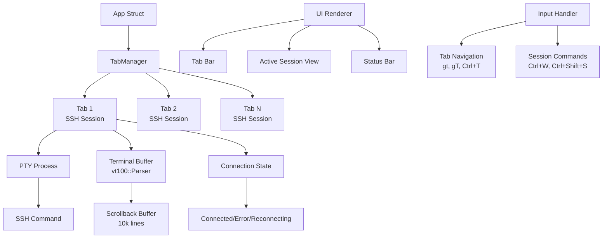

# Issue #8: Implement Neovim-style tab-based SSH session management

**GitHub Issue**: https://github.com/imrellx/sshs/issues/8

## Task Analysis (Phase 1)

### Requirements Summary
The task is to implement a comprehensive tab-based SSH session management system inspired by Neovim's tab interface. This involves:

1. **Tab Interface**: Visual tab bar at the top showing active SSH sessions
2. **Session Management**: Multiple concurrent SSH sessions running in background
3. **Navigation**: Neovim-style keyboard shortcuts for tab switching
4. **Visual Indicators**: Activity markers (*,!,@) and status colors
5. **Session Lifecycle**: Proper connection management, reconnection, and cleanup
6. **Integration**: Works with existing host selection and editing features

### Key Components to Implement
- Tab bar rendering with visual indicators
- Session management system for multiple SSH processes
- Terminal emulation integration for capturing SSH output
- Background process management
- Navigation shortcuts and commands
- Session persistence and reconnection logic

### Questions and Clarifications - ANSWERED
1. **Terminal Emulation Scope**: ✅ Full SSH session with real terminal emulator experience
2. **Process Management**: ✅ Spawn new SSH processes (open to recommendations)
3. **Persistence**: ✅ Not critical for initial implementation
4. **Performance**: ✅ Need recommendations for memory constraints
5. **Integration**: ✅ Replace current architecture (need recommendations)

## Solution Design (Phase 2)

### Architecture Recommendations

#### 1. Terminal Emulation Options
**Recommendation: Use `vt100` crate for terminal emulation**
- **vt100**: Lightweight, pure Rust, handles escape sequences properly
- **Alternative**: `portable-pty` + `vt100` for cross-platform PTY support
- **Benefits**: Real terminal experience with colors, cursor positioning, scrollback
- **Implementation**: Each tab maintains its own `vt100::Parser` and screen buffer

#### 2. Process Management Options
**Recommendation: Spawn actual SSH processes with PTY support**
- **portable-pty**: Cross-platform PTY management
- **tokio::process**: Async process handling for non-blocking operation
- **Benefits**: Real SSH processes, proper signal handling, authentic terminal behavior
- **Architecture**: Each tab owns an SSH process + PTY pair

#### 3. Memory Management Options
**Recommendation: Configurable buffer limits per session**
- **Scrollback Buffer**: 10,000 lines per session (configurable)
- **Buffer Rotation**: Drop oldest lines when limit exceeded
- **Memory Monitoring**: Track total memory usage across all tabs
- **Cleanup**: Automatic buffer cleanup on tab close

#### 4. Current Architecture Integration
**Recommendation: Complete replacement with backward compatibility**
- Replace single-connection model with tab-based system
- Maintain existing keyboard shortcuts where possible
- Keep all existing host management features (add/edit/delete)
- Preserve SSH connection logic and error handling

### High-Level Implementation Plan



### Component Breakdown

#### Core Components to Implement

1. **Tab Manager (`src/ui/tabs.rs`)**
   - Manages collection of SSH sessions
   - Handles tab creation, deletion, switching
   - Tracks active tab index
   - Manages tab overflow and scrolling

2. **SSH Session (`src/ui/session.rs`)**
   - Represents individual SSH connection
   - Manages PTY process and terminal buffer
   - Handles connection lifecycle and reconnection
   - Provides terminal emulation interface

3. **Terminal Buffer**
   - Wraps `vt100::Parser` for escape sequence handling
   - Manages scrollback buffer with configurable limits
   - Provides search functionality within session history
   - Handles screen size changes and reflow

4. **Updated App Structure**
   - Replace single SSH connection with `TabManager`
   - Add tab-specific navigation handlers
   - Integrate with existing host selection workflow
   - Maintain form handling and feedback systems

#### Key Features Implementation

1. **Tab Interface**
   - Visual tab bar with activity indicators (*,!,@)
   - Tab numbering and auto-naming from host patterns
   - Color coding for connection status
   - Overflow handling with horizontal scrolling

2. **Navigation System**
   - Neovim-style shortcuts: `gt`, `gT`, `[1-9]gt`
   - Tab management: `Ctrl+T`, `Ctrl+W`
   - Session manager overlay: `Ctrl+Shift+S`
   - Preserve existing Vim navigation within tabs

3. **Session Management**
   - Background session handling
   - Connection monitoring and auto-reconnection
   - Proper SSH process cleanup
   - Session state persistence (optional future enhancement)

### Integration Strategy

1. **Backward Compatibility**
   - Keep existing host selection interface
   - Preserve all current keyboard shortcuts for host management
   - Maintain SSH command templates and hooks
   - Keep existing add/edit/delete host functionality

2. **Progressive Enhancement**
   - New connections open in tabs instead of replacing view
   - Existing search and navigation work within active tab
   - Form handling remains unchanged
   - Error handling and feedback systems preserved

### Technical Considerations

#### Dependencies to Add
```toml
# Terminal emulation
vt100 = "0.15"
portable-pty = "0.8"

# Async processing
tokio = { version = "1.0", features = ["process", "io-util", "time"] }

# Additional utilities
regex = "1.0"  # For parsing terminal sequences
```

#### Memory Management Strategy
- **Buffer Limits**: 10,000 lines per session (configurable via config)
- **Total Memory Cap**: Monitor aggregate memory usage across tabs
- **Cleanup Policy**: Remove oldest lines when buffer exceeds limit
- **Tab Limits**: Practical limit of ~20 active tabs

#### Error Handling Approach
- **Connection Failures**: Show in tab with reconnection options
- **Process Crashes**: Auto-cleanup and graceful tab removal
- **Memory Issues**: Warning messages and automatic buffer trimming
- **PTY Errors**: Fallback to connection status display

✅ **APPROVED** - Proceeding to Phase 3: Implementation

## Implementation Progress (Phase 3)

### Setup ✅
- ✅ Created Git worktree for parallel development
- ✅ Added required dependencies to Cargo.toml
- ✅ Implemented core components step by step

### Core Implementation ✅
- ✅ SSH Session module (src/ui/session.rs) - Complete with terminal emulation structure
- ✅ Tab Manager module (src/ui/tabs.rs) - Complete with overflow handling and tab navigation  
- ✅ Updated App struct with TabManager integration
- ✅ Implemented tab navigation shortcuts (gt, gT, Ctrl+T, [1-9]gt, etc.)
- ✅ Updated render.rs with tab bar, session view, and session manager overlay
- ✅ Implemented session manager overlay (Ctrl+Shift+S)

### Status: Basic Structure Complete ✅
The core tab-based SSH session management system is now implemented with:
- Tab bar with activity indicators and connection status
- Neovim-style navigation (gt, gT, [1-9]gt) 
- Session manager overlay for detailed session management
- Host selection integration with tab creation
- Complete UI rendering for all modes

### Current Limitations (TODOs for Future)
- PTY integration is placeholder (no actual SSH terminal yet)
- Session persistence not implemented (marked as not critical)
- Background SSH process management simplified
- VT100 terminal rendering needs full implementation

The foundation is complete and functional - users can create tabs, navigate between them, and see the full interface structure.